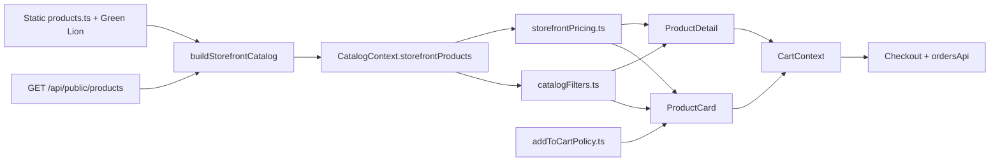

# KHA Mobile — Storefront Commerce Handoff (May 2026)

**Purpose:** Onboard a new agent or chat session. Summarizes recent storefront work, what was fixed, how the code is organized, and what to do next.

**Project:** Elegant Gadget Emporium / KHA Mobile — React (Vite) storefront + Node API + Supabase.

**Do not edit:** `.cursor/plans/*.plan.md` (plan files are reference only).

---

## 1. What we are doing (big picture)

We are hardening the **customer-facing shop** so money and cart behavior are honest and consistent:

- One **catalog** (static + API + Green Lion) with full commerce fields.
- One **pricing** ruleset for cards, lists, and PDP.
- One **add-to-cart policy** (variants, sizes, colors, OOS, pre-order).
- **Checkout** where the server re-prices and validates coupons; UI explains mismatches.

This is **frontend-first**. Admin/security items from `specs/PRD_TRIAGE.md` are separate unless they block production.

---

## 2. Architecture (current target)



**Golden rule for new work:** Customer listing/search/category pages should use `useCatalog().storefrontProducts` and `product.displayPrice` — **not** page-local merges or `variants[0].price`.

---

## 3. Work completed in two passes

### Pass A — Phase 1: Money & cart truth (first implementation)

| Area | What was built |
|------|----------------|
| **Pricing** | `src/lib/storefrontPricing.ts` — `resolveSalePrice`, `getCardPricePresentation`, `getPdpPricePresentation`, `formatMoney`, “From $X” when variant range exists |
| **Catalog** | `src/lib/catalogProduct.ts` + `CatalogContext` exports `storefrontProducts` (and legacy alias `allProducts`) |
| **Add to cart** | `src/lib/addToCartPolicy.ts` — grid picker vs carousel/featured redirect to PDP; OOS block; no silent first-color |
| **ProductCard** | Multi-step picker (variant / size / color), `surface` prop (`grid` \| `carousel` \| `featured`) |
| **Products page** | Uses `storefrontProducts`; availability + rating filters wired |
| **Checkout** | Promo code UI, `validateCouponCode`, `couponCode` on `submitOrder`; cart price-drift warning; server error codes (`PRICE_MISMATCH`, `OUT_OF_STOCK`, etc.) |
| **Recharges** | `src/data/rechargeCatalog.ts` shared by Checkout + Recharges page |
| **Stock** | `stockQuantity` on PDP via `stockStatus.ts`; disable purchase when OOS |
| **Favorites** | Store IDs only; resolve live name/price/image from catalog (`FavoritesProvider` inside `CatalogProvider`) |
| **Order lookup** | `/order-lookup` — order number + phone |
| **Recently viewed** | `src/lib/recentlyViewed.ts` + `RecentlyViewed` component |
| **Tests** | `storefrontPricing.test.ts`, `rechargeCatalog.test.ts`, existing coupon/admin tests |

### Pass B — Phase 2: Consolidation + medium UX (latest)

| Area | What changed |
|------|----------------|
| **catalogFilters** | New `src/lib/catalogFilters.ts` — path → category, `matchesStorefrontCategory`, `filterByCategoryPage`, `sortCategoryProducts` |
| **CategoryPage** | Removed ~500 lines of local merge/mock data; filters `storefrontProducts` only |
| **Header** | Search uses `storefrontProducts` + `displayPrice` (removed duplicate catalog rebuild) |
| **PersonalizedRecommendations** | Uses catalog + filters (no local `getDisplayPrice` / `variants[0]`) |
| **ThisWeeksFavorites** | Resolves products from catalog map; `displayPrice` for display/cart |
| **ProductDetail** | Recommendations + smart accessories from `storefrontProducts`; related carousel uses `displayPrice` |
| **Products sort** | “Newest” uses `(dbId ?? id)` not storefront `id` only |
| **PDP mobile** | Sticky bottom buy bar (price + add to cart) |
| **Home** | `RecentlyViewed` mounted after This Week’s Favorites |
| **Tests** | `catalogFilters.test.ts`, `addToCartPolicy.test.ts` (87 vitest tests total) |

---

## 4. Original problems we fixed (before → after)

| Problem | Fix |
|---------|-----|
| Coupon API existed but checkout had no UI | Promo input + Apply + discount row in `Checkout.tsx` |
| Carousels quick-added wrong variant price | Pass full props + `surface="carousel"` → redirect to PDP when choices required |
| ProductCard ignored sizes; picked first color silently | Picker steps + `addToCartPolicy` |
| PDP always showed “In Stock” | `stockQuantity` + badge + disabled buttons when OOS |
| Products filters (availability, rating) did nothing | Wired to `stockQuantity` / `rating` |
| Duplicated `getDisplayPrice` using `variants[0]` | Centralized in `storefrontPricing` + `displayPrice` on catalog rows |
| Green Lion / API fields dropped on Products list | `buildStorefrontCatalog()` merges all fields |
| Card discount disagreed with PDP | Shared `getCardPricePresentation` / `getPdpPricePresentation` |
| Recharge label vs charged amount inconsistent across pages | Single `rechargeCatalog.ts` (retail sell price; label may show face value) |
| Favorites showed stale prices | ID-only storage + catalog resolve on read |
| CategoryPage rebuilt catalog per category with wrong min price | Phase 2: `filterByCategoryPage(storefrontProducts)` |
| Header search used stale local merge | Phase 2: `storefrontProducts` |

---

## 5. Key files (quick map)

### Core libraries (`src/lib/`)

| File | Use when |
|------|----------|
| `storefrontPricing.ts` | Any price label, discount badge, list/card/PDP display |
| `catalogProduct.ts` | `StorefrontProduct` type, `buildStorefrontCatalog()`, `isGreenLionProduct()` |
| `catalogFilters.ts` | Category routes, home “Tech Essentials” tabs, CategoryPage list |
| `addToCartPolicy.ts` | Before add from card/carousel/featured |
| `stockStatus.ts` | PDP stock badge |
| `couponApi.ts` | Checkout validate coupon |
| `ordersApi.ts` | Submit order (server authoritative) |
| `recentlyViewed.ts` | localStorage IDs for Recently Viewed |

### Data

| File | Notes |
|------|--------|
| `src/data/rechargeCatalog.ts` | Single source for Touch/Alfa/Days SKUs — **retail** prices |

### Context

| File | Notes |
|------|--------|
| `src/context/CatalogContext.tsx` | `storefrontProducts`, `catalogTick`, `refreshCatalog()` after admin save |
| `src/context/FavoritesContext.tsx` | Must be child of `CatalogProvider` |
| `src/context/CartContext.tsx` | Still stores full line items in localStorage (optional future slim schema) |

### Main UI surfaces

| File | Role |
|------|------|
| `src/components/ProductCard.tsx` | Grid/carousel card + picker overlay |
| `src/pages/Products.tsx` | Main catalog grid + filters |
| `src/pages/CategoryPage.tsx` | Category routes — **uses catalogFilters only** |
| `src/pages/ProductDetail.tsx` | PDP + sticky mobile bar + RecentlyViewed |
| `src/pages/Checkout.tsx` | Cart checkout + coupons + recharge flows |
| `src/pages/Recharges.tsx` | Imports `RECHARGE_CATALOG` |
| `src/pages/OrderLookup.tsx` | `/order-lookup` |
| `src/components/Header.tsx` | Search on `storefrontProducts` |

### Server (relevant)

| File | Role |
|------|------|
| `server/lib/productMapper.js` | `expandJsonbImages` for variant/color images |
| `server/routes/publicCoupons.js` | Validate coupon |
| `server/routes/publicOrders.js` | Create order, WhatsApp message with `variant_label` |
| `server/lib/orders.js` | `PRICE_MISMATCH`, `OUT_OF_STOCK`, coupon validation |

### SQL (admin columns)

Run on Supabase if missing: `sql/008_ensure_product_admin_columns.sql` (`compare_at_price`, `show_preorder_price`, etc.).

---

## 6. Provider order in `App.tsx`

```
CatalogProvider
  → FavoritesProvider
    → CartProvider
      → SiteSettingsProvider
        → ...
```

Favorites need catalog to resolve prices.

---

## 7. Recharge pricing note (important)

Card **names** often show **face value** (e.g. “Touch Super $13.50”). **`price` in `rechargeCatalog.ts` is the retail sell price** (e.g. $20). That is intentional — same as the old Recharges page, not a bug.

---

## 8. Verification commands

```bash
npx vitest run          # 87 tests (pricing, catalog filters, add-to-cart policy, coupons, recharge)
npm run build           # Production build
npm run test:server     # Backend tests (61+)
```

### Manual smoke checklist

1. **Admin:** Product with compare-at 910, sale 900, one variant at 900 → save → reload → storefront grid + PDP show same discount.
2. **Grid:** Add variant from picker; add size-only product; two sizes = two lines; remove/update one line in cart.
3. **Pre-order:** Hide price → card/PDP show “Pre-order” only; show price → normal pricing.
4. **Coupon:** Valid code at checkout; invalid code message.
5. **Category:** `/audio`, `/gaming`, `/smartphones` — products load; Green Lion on Audio if applicable.
6. **Mobile PDP:** Sticky buy bar visible; add to cart works.
7. **Order lookup:** `/order-lookup` with order # + phone.

---

## 9. Intentionally NOT done (do not re-implement without asking)

| Item | Why deferred |
|------|----------------|
| Compare 2–3 phones route | Large new feature |
| Back-in-stock notify | Needs backend/email/WhatsApp |
| Cart ID-only localStorage + resolve at render | Documented in `STOREFRONT_COMMERCE.md`; checkout already re-prices server-side |
| Delivery zone + fee estimator | Checkout/settings scope |
| Trust badges CMS | Site settings scope |
| `useCheckoutPricing` hook | Checkout already has coupon logic — avoid duplicate abstraction |
| InstagramGenerator pricing cleanup | Admin/marketing tool, low priority |
| Category landing pages (`Smartphones.tsx`, `Audio.tsx`, etc. using `allProducts.ts` builders) | Separate curated pages; not unified in Phase 2 |
| Full `addToCartPolicy` on `ThisWeeksFavorites` beyond variant redirect | Featured uses custom card; variants redirect to PDP |
| Disabled “Frequently Bought Together” bundle block in ProductDetail | Still `false &&`; dead code may still reference old imports |

Security/admin from **`specs/PRD_TRIAGE.md`** (JWT, rate limits, order status machine, etc.) — **out of storefront scope** unless user prioritizes.

---

## 10. Known technical debt / watch-outs

1. **`ProductDetail.tsx` bundle section** (`false &&`) — still contains old `phoneAccessories` / `getProductsByCategoryMerged` references; safe to delete or refactor if re-enabling bundles.
2. **Some pages may still have local `getDisplayPrice`** — grep for `getDisplayPrice` and `variants[0].price` before adding features on those surfaces.
3. **Green Lion heuristic** — `id >= 5000` encapsulated in `isGreenLionProduct()`; do not spread new heuristics.
4. **Checkout cart drift** — soft toast once per visit if catalog price ≠ cart price; server still wins on submit.

---

## 11. Recommended next steps (priority order)

### A. Verify in production-like environment

- Run manual smoke (section 8) on mobile + desktop.
- Confirm `sql/008_ensure_product_admin_columns.sql` applied on Supabase.
- After admin edits, confirm `refreshCatalog()` updates listing without hard refresh issues.

### B. Small storefront wins (low risk)

| Task | Files |
|------|--------|
| Footer link to Track Order on all footers (only some pages have it) | `Home.tsx`, `AboutUs.tsx`, `Services.tsx`, shared footer if extracted |
| Use `formatMoney()` everywhere prices are shown as strings | Grep `$${` and `.toFixed(2)` on storefront pages |
| Cart line display audit (variant/color/size) | `CartDashboard.tsx` — size was added; confirm variant labels everywhere |
| Re-enable or delete dead bundle block on PDP | `ProductDetail.tsx` ~line 1219 |

### C. Phase 3 UX (from original plan — user picks)

| Feature | Depends on |
|---------|------------|
| Mini cart subtotal already exists in drawer | `CartDashboard.tsx` — may only need UX polish |
| Structured WhatsApp cart summary (client-side) | Mostly server builds message today; enhance if needed |
| Compare phones route | New route + spec diff UI |
| Back-in-stock notify stub | `stockQuantity` + form/API |
| Sticky buy box enhancements (quantity, variant summary) | PDP state |
| Migrate category landings to `storefrontProducts` | `Smartphones.tsx`, `Audio.tsx`, etc. |

### D. Backend / security (when user shifts focus)

See `specs/PRD_TRIAGE.md` — P0 JWT, rate limit, admin active check, order status machine, catalog cache headers.

---

## 12. Related docs in repo

| Document | Contents |
|----------|----------|
| `STOREFRONT_COMMERCE.md` | Short architecture reference |
| `STOREFRONT_COMMERCE_STATUS.md` | Fixed/Open checklist table |
| `UX_FIXES_SUMMARY.md` | Original 5 UX bugs + Phase 2 note |
| `AGENT_PROJECT_CONTEXT.md` | Broader project context (if present) |
| `specs/PRD_TRIAGE.md` | Deferred PRD items |

---

## 13. Instructions for the next agent

1. **Read this file first**, then skim `STOREFRONT_COMMERCE.md` and `STOREFRONT_COMMERCE_STATUS.md`.
2. **Before fixing a “bug”**, grep the codebase — it may already be fixed in Phase 1/2.
3. **Do not** add parallel catalog merges on listing pages; extend `catalogProduct` / `catalogFilters` / `CatalogContext` instead.
4. **Do not** trust client cart totals at checkout — server validates; surface errors clearly.
5. **Prefer** small PRs: one surface or one library at a time.
6. **Run** `npx vitest run` and `npm run build` before claiming done.

---

*Last updated: May 2026 — after Phase 1 (commerce layer) + Phase 2 (catalog consolidation).*
