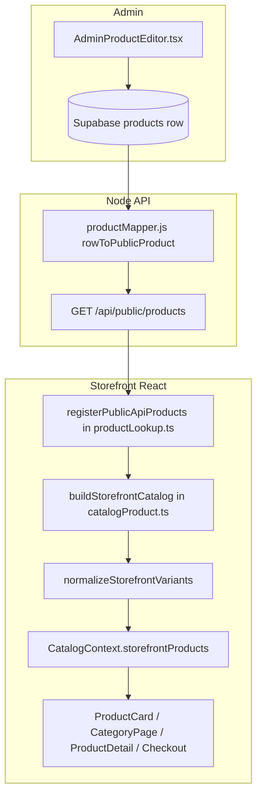

# KHA Mobile Storefront — Recent Work Log & New-Chat Audit Prompt

**Created:** May 2026  
**Audience:** You, future agents, and QA  
**Companion docs:** `AGENT_HANDOFF_STOREFRONT.md`, `STOREFRONT_COMMERCE.md`, `STOREFRONT_COMMERCE_STATUS.md`

**Do not edit:** `.cursor/plans/*.plan.md`

---

## Executive summary

Over several sessions we hardened the **customer storefront** so pricing, catalog, cart, and checkout behave consistently. Work spanned **Phase 1–2** (commerce layer + catalog consolidation), then a **polish pass** (formatMoney, footers, checkout/cart), **PDP mobile UX** (sticky bar + quantity), **cleanup** (dead bundle block, category landing aliases), and a **critical admin-product fix** for iPhone storage variants (duplicate keys, JSON shape, PDP vs grid mismatch).

**Current test baseline:** `npx vitest run` → **90 tests** pass. `npm run build` → OK.

**Golden rule (still in force):** Listing/search/category surfaces use `useCatalog().storefrontProducts` and `product.displayPrice`. Extend `catalogProduct`, `catalogFilters`, `storefrontPricing`, `addToCartPolicy` — do not add page-local catalog merges or `variants[0].price`.

---

## Architecture (how admin products reach the website)



**Important IDs**

- **DB `id`** — internal row id (`dbId` on storefront).
- **Storefront `id`** — `legacy_override_id` if set, else DB id (`storefrontIdFromRow` in `productMapper.js`). URLs like `/product/:id` use this.

**Where normalization happens (admin → display)**

| Step | File | What it does |
|------|------|----------------|
| API read | `server/lib/productMapper.js` | `coerceJsonArray()` on variants/colors/sizes JSONB; `expandJsonbImages()` |
| Client register | `src/data/productLookup.ts` | `mapApiToProduct` / `mapApiToGreenLion` + `normalizeStorefrontVariants()` |
| Catalog build | `src/lib/catalogProduct.ts` | `fromRegular` / `fromGreenLion` again normalize variants; `buildStorefrontCatalog()` |
| Add to cart | `src/lib/addToCartPolicy.ts`, `ProductCard.tsx` | Policy uses normalized variant count |
| PDP | `src/pages/ProductDetail.tsx` | `catalogRow` from `storefrontProducts`; selection by **variant key** |

---

## Work log by phase

### Phase 1 — Money & cart truth (baseline)

| Area | Deliverable |
|------|-------------|
| Pricing | `src/lib/storefrontPricing.ts` — `resolveSalePrice`, card/PDP presentation, `formatMoney` |
| Catalog | `src/lib/catalogProduct.ts`, `CatalogContext.storefrontProducts` |
| Cart policy | `src/lib/addToCartPolicy.ts` — picker vs redirect vs block |
| Checkout | Coupon UI, server-authoritative order submit, error codes |
| Recharges | `src/data/rechargeCatalog.ts` (single retail prices) |
| Stock / pre-order | `stockStatus.ts`, PDP + policy integration |
| Favorites | ID-only localStorage + catalog resolve |
| Order lookup | `/order-lookup` |
| Tests | pricing, recharge, coupon tests |

### Phase 2 — Consolidation

| Area | Deliverable |
|------|-------------|
| Filters | `src/lib/catalogFilters.ts` — category routes, shared sort |
| CategoryPage | No local merge; only `filterByCategoryPage(storefrontProducts)` |
| Header search | `storefrontProducts` + `displayPrice` |
| Recommendations / favorites blocks | Catalog-backed, no `variants[0]` |
| Products sort | Newest by `(dbId ?? id)` |
| Tests | `catalogFilters.test.ts`, `addToCartPolicy.test.ts` (87 total at the time) |

### Pass 3 — Polish (Section 11B from handoff)

| Area | Files | What changed |
|------|-------|----------------|
| `formatMoney()` rollout | `CartDashboard`, `ProductCard`, `Header`, `ThisWeeksFavorites`, `Favorites`, `Checkout`, `Recharges` | One money formatter on customer surfaces |
| Footer “Track Order” | `Home`, `AboutUs`, `Services` | Link to `/order-lookup` (Home already had it; others aligned) |
| Cart drawer | `CartDashboard.tsx` | `size` in line keys; variant/color/size labels; Track order link; subtotal/total via `formatMoney` |
| Checkout cart lines | `Checkout.tsx` | `formatMoney`; pass `size` to remove/update; show size on lines |

### Pass 4 — PDP mobile UX

| Area | File | What changed |
|------|------|----------------|
| Sticky buy bar | `ProductDetail.tsx` | Variant/color/size summary; qty stepper; `cartQuantity` on add; disabled when options incomplete |
| In-page mobile CTAs | Same | Same qty + summary as sticky bar (gallery section) |
| Layout | Same | `pb-36` on mobile so content clears taller bar |

### Pass 5 — Cleanup & landings

| Area | Files | What changed |
|------|-------|----------------|
| Dead bundle | `ProductDetail.tsx` | Removed ~360 lines `{false && … Frequently Bought Together}` (broken static imports) |
| Category landings | `Smartphones.tsx`, `Audio.tsx` | Re-export `CategoryPage` only; **`App.tsx` already routes `/smartphones` and `/audio` to `CategoryPage`** |
| Imports | `ProductDetail.tsx` | Dropped unused `getProductsByCategoryMerged` etc. from dead bundle |

### Pass 6 — Admin iPhone / variant critical fix (your report)

**Symptoms you reported**

1. On PDP: selecting one storage variant also appeared to select another.
2. From grid/carousel: add-to-cart used “first option” without picker for **new admin iPhones** (e.g. iPhone 15 Pro Max, 14 Pro Max, …).

**Root causes found**

| Cause | Effect |
|-------|--------|
| Duplicate or **empty variant `key`** in admin JSON | React keys collide; cart `variantKey` matches wrong line; PDP highlight confusing |
| Variants stored as **JSON object** not array | API returned `variants: []` → `hasVariants` false → **silent `add_direct`** at base price |
| **Colors auto-selected** while product had **variants** | First color stayed highlighted when picking storage (looked like two selections) |
| PDP used `findStoreProductSplit` only | Could diverge from `storefrontProducts` used on listing cards |

**Fixes applied**

| Layer | Change |
|-------|--------|
| `catalogProduct.ts` | `coerceVariantArray()`, `normalizeStorefrontVariants()` — unique keys, numeric prices, labels from storage/RAM |
| `productMapper.js` | `coerceJsonArray()` before expanding JSONB arrays |
| `productLookup.ts` | Normalize variants when registering API products |
| `addToCartPolicy.ts` | `hasVariants` uses normalized list |
| `ProductCard.tsx` | `normalizedVariants` for picker + policy |
| `ProductDetail.tsx` | `catalogRow` from `storefrontProducts`; select variant by **`selectedVariantKey`**; no auto-color when `variantOptions.length > 0` |
| `CategoryPage.tsx` | Stable keys on smartphone variant chips: `` `${product.id}-${variant.key}-${vi}` `` |
| Tests | `src/tests/catalogProduct.test.ts` (3 tests) → **90** vitest total |

---

## Files touched in recent sessions (quick index)

### Core libraries

- `src/lib/storefrontPricing.ts` — unchanged logic; wider `formatMoney` usage
- `src/lib/catalogProduct.ts` — **+normalize/coerce/getStorefrontProductById**
- `src/lib/catalogFilters.ts` — Phase 2
- `src/lib/addToCartPolicy.ts` — **+normalize for variant detection**
- `src/data/productLookup.ts` — **+normalize on API map**
- `src/data/rechargeCatalog.ts` — Phase 1

### Context & pages

- `src/context/CatalogContext.tsx` — `storefrontProducts`
- `src/pages/ProductDetail.tsx` — sticky bar, mobile CTAs, catalog merge, variant keys, bundle removed
- `src/pages/Checkout.tsx`, `src/components/CartDashboard.tsx`
- `src/components/ProductCard.tsx`, `Header.tsx`, `ThisWeeksFavorites.tsx`, `Favorites.tsx`
- `src/pages/Recharges.tsx`, `CategoryPage.tsx`
- `src/pages/Smartphones.tsx`, `Audio.tsx` — re-exports only
- `src/pages/Home.tsx`, `AboutUs.tsx`, `Services.tsx` — footer links

### Server

- `server/lib/productMapper.js` — **coerceJsonArray**
- `server/routes/publicOrders.js`, `publicCoupons.js` — Phase 1 (reference)

### Tests

- `src/tests/storefrontPricing.test.ts`
- `src/tests/catalogFilters.test.ts`
- `src/tests/addToCartPolicy.test.ts`
- `src/tests/rechargeCatalog.test.ts`
- `src/tests/catalogProduct.test.ts` — **new**

---

## Verification checklist

```bash
npx vitest run          # expect 90 passed
npm run build           # production build
npm run test:server     # backend tests (if API changed)
```

**Manual — general storefront**

1. `/products`, `/smartphones`, `/audio` — grids load; prices match PDP.
2. Product with variants — card opens **picker** (grid) or redirects (carousel).
3. PDP — one variant highlighted; cart line shows correct label/price.
4. Checkout — coupon, cart lines with variant/size, server total authoritative.
5. `/order-lookup` — form loads.

**Manual — admin-added phones (critical)**

1. Start **API** (`localhost:3001` or production) + **Vite** dev server.
2. Open an admin iPhone with multiple storage variants (e.g. iPhone 15 Pro Max).
3. **PDP:** Click 128GB → only 128GB active. Click 256GB → only 256GB active (not both).
4. **Category grid:** Tap cart → picker appears; choosing storage adds correct price (not base-only silent add).
5. **Cart:** Two different storages = **two lines** with different `variantLabel`/price.
6. After admin save → `refreshCatalog()` or hard refresh → listing price updates.

**SQL (if columns missing):** `sql/008_ensure_product_admin_columns.sql` on Supabase.

---

## Known gaps & intentional deferrals

| Item | Notes |
|------|--------|
| Compare phones route | Not built |
| Back-in-stock notify | No API |
| Cart ID-only localStorage migration | Optional; checkout re-prices server-side |
| `Gaming.tsx`, `Wearables.tsx`, `Accessories.tsx` | Still old `build*Products()` wrappers if imported; routes in `App.tsx` mostly point at `CategoryPage` |
| `InstagramGenerator` / marketing pages | May still use local `getDisplayPrice` / static arrays |
| `specs/PRD_TRIAGE.md` security | Out of storefront scope unless prioritized |
| One-time DB repair for bad variant keys | Not automated; admin should give each variant a **unique key**; runtime normalization mitigates |

---

## Admin editor guidance (prevent recurrence)

In **Admin → Product editor → Variants** tab:

- Every variant row needs a **unique key** (editor validates on save).
- Storage SKUs belong in **Variants**, not only in **Colors** (colors are for paint/finish; auto-select color is disabled when variants exist).
- After save, confirm **GET /api/public/products** returns `variants` as a **JSON array** with distinct keys.

---

# Copy-paste prompt for a new chat (admin → storefront audit)

Use the block below in a **new Cursor chat** when you want a focused audit for “admin products break on the website” class bugs.

---

```markdown
## Role

You are auditing the KHA Mobile storefront (React/Vite + Node API + Supabase) for **critical bugs when products created/edited in admin appear on the public website**. A recent production issue: admin iPhones with storage variants showed (1) multiple variants appearing selected on PDP, and (2) grid add-to-cart silently using the first/base price without a picker.

## Read first (in order)

1. `STOREFRONT_RECENT_WORK_AND_NEW_CHAT_PROMPT.md` (this file — recent fixes)
2. `AGENT_HANDOFF_STOREFRONT.md`
3. `STOREFRONT_COMMERCE.md`

Do **not** edit `.cursor/plans/*.plan.md`.

## Golden rules

- Listings/search/categories: `useCatalog().storefrontProducts` + `displayPrice` — no page-local catalog merges, no `variants[0].price`.
- Extend `catalogProduct`, `catalogFilters`, `storefrontPricing`, `addToCartPolicy` — no duplicate abstractions.
- Checkout/server is authoritative for money; do not trust client-only totals.
- Do **not** re-implement: compare-phones route, back-in-stock API, cart ID-only migration, `specs/PRD_TRIAGE.md` security work — unless I ask.

## Your mission

Find **remaining** admin→storefront gaps similar to the variant bug. Work systematically; run commands; fix only what you can prove.

### A. Data pipeline audit

Trace one admin product from DB → API → `registerPublicApiProducts` → `buildStorefrontCatalog` → `ProductCard` / `ProductDetail` / `Checkout`:

| Check | Where to look |
|-------|----------------|
| JSONB shape | `server/lib/productMapper.js` — variants/colors/sizes arrays vs objects |
| Variant keys unique | `normalizeStorefrontVariants` in `src/lib/catalogProduct.ts` |
| Storefront id vs db id | `storefrontIdFromRow`, `findStoreProductSplit`, URLs `/product/:id` |
| API-only products | `eachApiCatalogProduct` in `buildStorefrontCatalog` — not dropped from map |
| Stale static override | `mergeRegularWithStaticImages`, placeholder images hiding API fields |
| PDP vs grid same source | `ProductDetail` uses `getStorefrontProductById(storefrontProducts, id)` |

### B. Add-to-cart / selection audit

| Check | Where to look |
|-------|----------------|
| Policy sees variants | `addToCartPolicy.ts` + normalized variants |
| Grid vs carousel vs featured | `surface` prop on `ProductCard` |
| Picker steps | `getPickerSteps` — variant / size / multi-color order |
| PDP selection | `selectedVariantKey` not index; color auto-select when variants exist |
| Cart line identity | `CartContext` — `variantKey`, `color`, `size` in `isSameCartItem` |
| Silent add_direct | Any path that skips picker when `normalizeStorefrontVariants(...).length > 0` |

### C. Pricing audit

| Check | Where to look |
|-------|----------------|
| Card vs PDP vs cart | `resolveSalePrice`, `getPdpPricePresentation`, line item price at add time |
| compareAt / pre-order | `showPreorderPrice`, `preorderHideNumeric` |
| Green Lion `id >= 5000` | `isGreenLionProduct()` only — no new heuristics |
| displayPrice on rows | Set in `fromRegular` / `fromGreenLion` |

### D. Surfaces still on old patterns

Grep and list files still using:

- `buildSmartphonesProducts`, `buildAudioProducts`, `getDisplayPrice`, `variants[0]`
- Local merges in `allProducts.ts` builders on **customer** routes
- `findStoreProductSplit` on PDP **without** merging `storefrontProducts` row

Pay extra attention to: `Home.tsx` trending sections, `Accessories.tsx`, `AboutUs.tsx` product counts, `InstagramGenerator`, admin-only pages (skip unless they affect storefront).

### E. Reproduce with API running

1. `npx vitest run` and `npm run build`
2. Dev: API on :3001, Vite storefront — load `/smartphones`, open admin iPhone PDP
3. Confirm picker + single variant selection + cart lines

### Output format

1. **Findings table** — Severity (P0/P1/P2), symptom, root cause, file:line, suggested fix size
2. **What was already fixed** — brief (point to Pass 6 in STOREFRONT_RECENT_WORK_AND_NEW_CHAT_PROMPT.md)
3. **Recommended next PRs** — small, ordered
4. **Only then** implement P0/P1 fixes if clear; run tests after each batch

Do not commit unless I ask. Propose a short plan before large diffs.
```

---

## Related commands

```bash
# Find risky patterns
rg "variants\[0\]|getDisplayPrice|buildSmartphonesProducts|buildAudioProducts" src
rg "add_direct|open_picker" src
rg "normalizeStorefrontVariants|coerceVariantArray" src

# Tests
npx vitest run
npm run build
```

---

*Last updated: May 2026 — after Phase 1–2, polish pass, PDP sticky/qty, landing cleanup, and admin variant normalization (90 vitest).*
