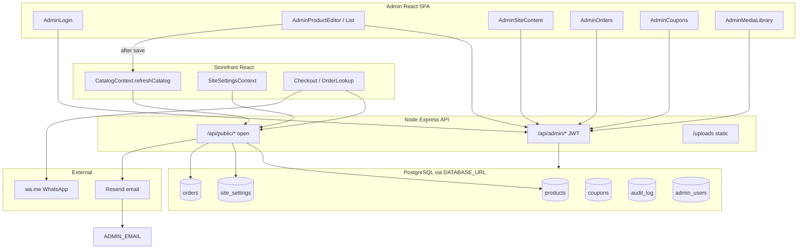
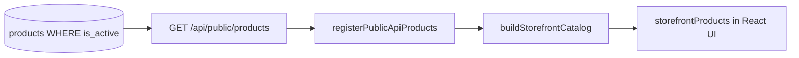
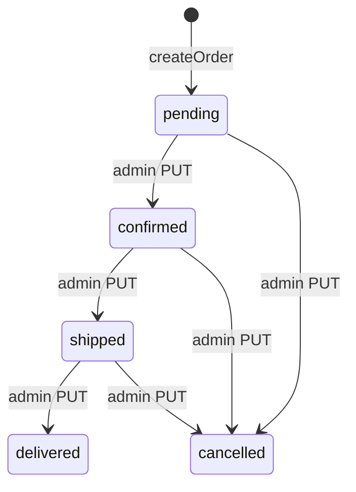

# KHA Mobile — Admin System Specification

**Last updated:** _May 2026 — Phases 0–6 complete_

**Audience:** Operators, developers, and agents maintaining the admin panel and its connection to the public storefront.

**Companion docs:**
- [AGENT_HANDOFF_STOREFRONT.md](../AGENT_HANDOFF_STOREFRONT.md) — storefront catalog and commerce
- [STOREFRONT_COMMERCE.md](../STOREFRONT_COMMERCE.md) — pricing, cart, checkout modules
- [specs/PRD_TRIAGE.md](./PRD_TRIAGE.md) — deferred security and future work

---

## Table of contents

1. [Executive summary](#1-executive-summary)
2. [Access and security](#2-access-and-security)
3. [Admin navigation map](#3-admin-navigation-map)
4. [Product management](#4-product-management)
5. [How admin changes appear on the website](#5-how-admin-changes-appear-on-the-website)
6. [Orders workflow](#6-orders-workflow)
7. [Coupons workflow](#7-coupons-workflow)
8. [Customer contact channels](#8-customer-contact-channels)
9. [Supporting admin features](#9-supporting-admin-features)
10. [API reference](#10-api-reference)
11. [Database reference](#11-database-reference)
12. [Operator playbooks](#12-operator-playbooks)
13. [Known gaps and future work](#13-known-gaps-and-future-work)

---

## How to use this document

This spec is written **in phases**. Each section is filled by a dedicated pass that reads only the source files listed in the [phase index](#phase-index). Do not assume behavior that is not documented here or in the cited repo files.

- **Operators:** Start with [§12 Operator playbooks](#12-operator-playbooks) (once complete) and [§4 Product management](#4-product-management) for catalog work.
- **Developers:** Use [§10 API reference](#10-api-reference) and [§11 Database reference](#11-database-reference) after Phases 5–6.
- **Agents:** Complete one phase per session; update the phase index checkboxes when done.

---

## Global anti-hallucination rules

Every phase that adds content **must** follow these rules:

1. **Source-first:** Every route, endpoint, setting key, table name, and status enum must appear in that phase’s **Required reads**. If not found, write `_(not found in repo — verify)_` instead of guessing.
2. **No aspirational APIs:** Document **current** behavior only. Future features belong in [§13 Known gaps](#13-known-gaps-and-future-work) and must cite [PRD_TRIAGE.md](./PRD_TRIAGE.md) or be labeled **proposed**.
3. **Endpoint proof:** Before adding an API row, `grep` the path in `server/routes/` and confirm mount prefixes in `server/index.js`.
4. **Settings keys:** Only list keys present in `sql/004_seed_site_settings.sql`, `sql/009_orders_v2.sql`, or the `SiteSettings` type in `src/context/SiteSettingsContext.tsx`.
5. **IDs:** Always distinguish **`dbId`** (Postgres `products.id`, admin URLs) from **storefront `id`** (`legacy_override_id` if set, else `dbId`).
6. **Diagrams:** Reuse the [system context](#system-context) diagram by reference; add at most one new diagram per phase unless the phase owns architecture.
7. **Stop at scope:** If a topic belongs to a later phase, add a one-line “See §N” stub — do not fill it in early.

### Per-phase agent prompt template

```markdown
You are writing Phase N of specs/ADMIN_SYSTEM_SPEC.md for KHA Mobile.

READ ONLY these files: [list from phase plan]
WRITE ONLY these sections: [list from phase plan]
DO NOT write content for other sections.
VERIFY: run grep for every API path you document.
Env var names: copy from server/.env.example only.
```

---

## Phase index

| Phase | Sections | Status |
|-------|----------|--------|
| 0 | Scaffold, TOC, rules, diagram | [x] |
| 1 | §1 Executive summary, §2 Access and security, §3 Admin navigation map | [x] |
| 2 | §4 Product management | [x] |
| 3 | §5 How admin changes appear on the website | [x] |
| 4 | §6 Orders, §7 Coupons, §8 Customer contact channels | [x] |
| 5 | §9 Supporting features, §10 API reference, §11 Database reference | [x] |
| 6 | §12 Operator playbooks, §13 Known gaps | [x] |

---

## System context

High-level flow: admin UI and storefront share one React app; the Node API talks to PostgreSQL; product saves trigger a public catalog refresh on the client; orders can notify admin via email and customers via WhatsApp deep links.



**Stack notes (verified in repo structure):**
- Admin routes live under `/admin/*` in `src/App.tsx`.
- Persistence uses `pg` + `DATABASE_URL` (`server/lib/db.js`), not the Supabase JS client.
- Uploaded images: `server/uploads/`, paths stored as `/uploads/...`, expanded on read in `server/lib/productMapper.js`.

---

## 1. Executive summary

The **KHA Mobile admin panel** is a staff-only area of the same React app as the public storefront (`src/App.tsx`). It is used to manage the product catalog, homepage content, orders, coupons, and uploaded media. Typical users are **catalog operators** (products, prices, images, variants) and **fulfillment staff** (order status, payment flags, notes). There is no separate admin app binary—the UI is routes under `/admin/*` backed by a Node API on `VITE_API_URL` (default `http://localhost:3001`).

**Static vs database catalog:** Most products on the website start as bundled data in `src/data/` (e.g. `products.ts`, Green Lion lists). Those rows are read-only in admin until a matching **Postgres `products` row** exists. When staff create or override a product in admin, the row is stored in the database; if **Legacy Override ID** is set, that row replaces the static item with the same numeric id on the storefront. New products without an override get database ids (typically ≥ 100000) and appear as API-only additions after merge. See [§4 Product management](#4-product-management) and [§5 How admin changes appear on the website](#5-how-admin-changes-appear-on-the-website).

**Save product → website (one-liner):** After a successful product save, the editor calls `refreshCatalog()` in `CatalogContext`, which refetches `GET /api/public/products` and rebuilds `storefrontProducts` for listing pages, cards, and PDP—details in [§4](#4-product-management) and [§5](#5-how-admin-changes-appear-on-the-website).

---

## 2. Access and security

### How authentication works

| Layer | Mechanism | Source |
|-------|-----------|--------|
| **Login** | Email + password form → `POST /api/admin/login` with JSON `{ email, password }` | `AdminLogin.tsx` L25–40; `server/routes/adminAuth.js` L8–43 |
| **Token storage** | JWT string in `localStorage` key `kha_admin_token` | `src/lib/adminApi.ts` L1, L20–26 |
| **Client route guard** | `AdminLayout` `useEffect`: if `!getAdminToken()`, redirect to `/admin/login` with `state.from` = current path; renders `null` until token exists | `AdminLayout.tsx` L38–42, L53 |
| **Login redirect** | If token already present on `/admin/login`, navigate to `state.from` or `/admin/products` | `AdminLogin.tsx` L19–22 |
| **API requests** | `adminFetch(path)` prepends `apiBase()`, sets `Authorization: Bearer <token>`, `cache: no-store` | `adminApi.ts` L29–51 |
| **401 handling** | On 401 for any path **except** `/login`: clear token, `window.location.href = '/admin/login'` | `adminApi.ts` L45–49 |
| **API guard** | `requireAdmin` middleware: requires `Bearer` JWT, `jwt.verify` with `JWT_SECRET`, sets `req.admin` payload | `server/middleware/auth.js` L17–34 |
| **JWT payload** | `sub` (admin user id), `email`, `role`; **expires in 7 days** | `auth.js` L5–14 |
| **Sign out** | `setAdminToken(null)` + navigate to `/admin/login` | `AdminLayout.tsx` L48–50 |
| **Login-time account check** | Query `admin_users`; reject if missing user or `is_active = false`; bcrypt password compare | `adminAuth.js` L16–27 |

**Mount path:** `adminAuthRouter` is mounted on the admin router at `/login`; the app mounts `app.use('/api/admin', adminRouter)` in `server/index.js` L77 → full login URL **`POST /api/admin/login`**.

### Admin accounts (database)

- Table: `admin_users` (`sql/001_schema.sql` L10–18).
- **`role` column:** `VARCHAR(50) NOT NULL DEFAULT 'admin'` — the seed file sets `'admin'`; no other roles are defined in application code beyond storing `role` in the JWT.
- **Dev seed:** `sql/002_seed_admin.sql` inserts one user (`kamelamer@admin.com`, display name “Store Admin”). Regenerate password hashes with `server/scripts/hash-admin-password.mjs`. **Do not commit or paste production passwords into this spec.**

### Prerequisites for admin to work

- API server running (`npm run dev` in `server/`) with `DATABASE_URL` set (`requirePool` on login).
- Storefront `.env`: `VITE_API_URL` pointing at the API; optional `VITE_SITE_URL` for “View Store” / login links (`adminApi.ts` L3–17).
- CORS: storefront origin in server `FRONTEND_ORIGIN` (noted on login page help text, `AdminLogin.tsx` L106–108).

### Known gaps (current behavior — not bugs in this doc)

These are **not implemented** in the repo today; see [PRD_TRIAGE.md](./PRD_TRIAGE.md) for prioritized fixes:

- **No `GET /api/admin/me`** — layout does not validate the JWT with the server on mount (token presence only). PRD item P1-05.
- **No `is_active` check on each API request** — deactivated users remain authorized until JWT expires; only checked at login (`adminAuth.js` L22).
- **No login rate limiting** — `grep` finds no `rateLimit` in `server/`.
- **No shared `ProtectedRoute` component** — guard logic lives only in `AdminLayout`.

Product APIs, orders, and full DB schema are documented in later sections — not here.

---

## 3. Admin navigation map

Routes are declared in `src/App.tsx` L104–116. `/admin/login` is **outside** `AdminLayout`; all other admin pages are nested children rendered via `<Outlet />`.

### Route table

| URL path | Component file | Purpose |
|----------|----------------|---------|
| `/admin/login` | `src/pages/admin/AdminLogin.tsx` | Sign in (no sidebar) |
| `/admin` | — | Redirects to `products` (`Navigate` index route, L106) |
| `/admin/products` | `src/pages/admin/AdminProductList.tsx` | Product list, search, bulk actions |
| `/admin/products/new` | `src/pages/admin/AdminProductEditor.tsx` | Create product |
| `/admin/products/:dbId` | `src/pages/admin/AdminProductEditor.tsx` | Edit product (**`dbId` = Postgres `products.id`**) |
| `/admin/orders` | `src/pages/admin/AdminOrders.tsx` | Order list and fulfillment |
| `/admin/coupons` | `src/pages/admin/AdminCoupons.tsx` | Coupon CRUD |
| `/admin/media` | `src/pages/admin/AdminMediaLibrary.tsx` | Upload library under `server/uploads/` |
| `/admin/site-content` | `src/pages/admin/AdminSiteContent.tsx` | Homepage / marketing JSON settings |
| `/admin/analytics` | `src/pages/AdminDashboard.tsx` | Analytics UI (**not** under `src/pages/admin/`) |
| `/admin/audit-log` | `src/pages/admin/AdminAuditLog.tsx` | Activity log |

### Sidebar groups (`AdminLayout.tsx`)

Defined in `catalogNav` (L13–18) and `siteNav` (L20–24):

| Sidebar section | Links |
|-----------------|--------|
| **Catalog** | Products → `/admin/products`; Orders → `/admin/orders`; Coupons → `/admin/coupons`; Media Library → `/admin/media` |
| **Management** | Site Content → `/admin/site-content`; Analytics → `/admin/analytics`; Activity Log → `/admin/audit-log` |
| **Store** | View Store → `siteUrl()` + `/` (new tab, external link, L134–145) |

**Sidebar extras:** Product count cards use `useCatalog().allProducts` (total vs `isActive !== false`, L34–36). Footer: “Admin / Logged in” + **Sign out** (L149–166).

**Mobile:** Hamburger opens the same nav in a drawer; sticky header shows active page icon (`AdminLayout.tsx` L204–231).

### Analytics page note

The **Analytics** nav item routes to `AdminDashboard`, imported from `src/pages/AdminDashboard.tsx` (`App.tsx` L38, L110)—not from `src/pages/admin/`. Behavior (localStorage-only metrics) is documented in [§9 Supporting admin features](#9-supporting-admin-features) when Phase 5 runs.

### APIs used from the shell (login only)

This section lists **navigation and auth** only. The login endpoint is `POST /api/admin/login`. All other admin HTTP APIs are listed in [§10 API reference](#10-api-reference) after Phase 5.

---

## 4. Product management

Admin product CRUD is implemented in **`AdminProductEditor`** (create/edit) and **`AdminProductList`** (list, bulk, delete). All writes go to the Postgres **`products`** table via **`server/routes/adminProducts.js`**. There is **no PATCH** for products — only **POST** (create) and **PUT** (full replace update); confirmed by `grep PATCH` on `adminProducts.js` (no matches).

How saved rows reach the public site is documented in [§5](#5-how-admin-changes-appear-on-the-website) (not repeated here).

### 4.1 Editor tabs and form state

**File:** `src/pages/admin/AdminProductEditor.tsx`

| Tab id | Label | Main fields |
|--------|--------|-------------|
| `basics` | Basics | Name, title, category, brand, sale/compare-at pricing, legacy override id, rating, pre-order flags, active, stock quantity |
| `images` | Images & Media | Primary image, gallery, video URL |
| `content` | Content | Description, features (string list) |
| `specs` | Specifications | `{ label, value }[]` rows |
| `options` | Variants & Colors | Variants, colors, sizes, connectivity options, secondary categories |

**`FormState`** (L36–61) fields: `legacyOverrideId`, `name`, `title`, `description`, `price`, `compareAtPrice`, `primaryImageUrl`, `rating`, `category`, `brand`, `videoUrl`, `isPreorder`, `showPreorderPrice`, `isActive`, `features`, `specifications`, `variants`, `colors`, `sizes`, `connectivityOptions`, `secondaryCategories`, `galleryImages`, `stockQuantity`.

**Categories** available in Basics: `Smartphones`, `Tablets`, `Audio`, `Computers`, `Wearables`, `Gaming`, `Accessories`, `Charging`, `Electronics`, `Other` (`BASE_CATEGORIES`, L63–66).

**Routes:**
- New: `/admin/products/new` (`isNew` when no `dbId` or `dbId === "new"`, L147–148).
- Edit: `/admin/products/:dbId` where **`dbId` is Postgres `products.id`**, not storefront `id`.

**Load (edit):** `GET /api/admin/products/:dbId` (L171). Response `product` is camelCase from `rowToPublicProduct`. Primary image may be merged with static bundled art via `resolvePrimaryImageWithStaticFallback` (L183–187). Prices split for the two Basics inputs via `formPricesFromLoadedProduct` (L188–191).

**Unsaved changes:** `useUnsavedChanges` when `form` JSON differs from `savedForm` (L156–157).

### 4.2 Pricing model (Basics tab)

**Files:** `src/lib/adminProductPricing.ts`, mirrored server-side in `validateProductPayload`.

| UI field | Meaning | Maps to DB |
|----------|---------|------------|
| **Sale price** (`form.price`) | Optional lower sell price | `products.price` |
| **Compare at (was)** (`form.compareAtPrice`) | List / original price | `products.compare_at_price` |

**Client rules** (`resolveCatalogPricesFromForm`, `computeCatalogSaveFromBasics`):
- At least one of sale or compare-at must be provided.
- If only compare-at is set (or sale is 0 with compare-at set), **`price` = compare-at**, `compare_at_price` = null (single list price).
- If both set: compare-at must be **≥** sale; if equal, compare-at cleared (no fake discount).
- Pre-order: **`price` cannot be 0** (client L77–78; server L122–124).
- Legacy override id: optional positive integer (client L81–86).
- Rating: 0–5 (client L88–91; DB constraint `products_rating_range`).

**On save:** `computeCatalogSaveFromBasics` runs first; body sends numeric `price` and `compareAtPrice` (L363–364).

**Variant/size price sync:** If the Basics sale price changed, variant rows (and sizes) whose price still matched the **previous** sale are updated to the new sale before submit (L329–352) so PDP variant pricing stays aligned with the base discount.

### 4.3 Save pipeline (admin → database)

Numbered flow from `AdminProductEditor.save` (L282–407) and `adminProducts.js`:

1. **Client — Basics validation:** `computeCatalogSaveFromBasics`; on failure, toast + switch to Basics tab.
2. **Client — Options validation:** Non-empty unique variant `key`; unique color `name`; unique size `name` (L297–327) — same rules as server `validateProductPayload` (L129–154).
3. **Client — Optional variant/size sync** when sale price changed (see §4.2).
4. **Client — Build JSON body** (camelCase, L358–382): see table below.
5. **HTTP:** `POST /api/admin/products` if new, else **`PUT /api/admin/products/:dbId`** via `adminFetch` (L383–384). **No PATCH.**
6. **Server — Map body:** `bodyToRowColumns(req.body)` → snake_case row (`productMapper.js` L147–197).
7. **Server — Validate:** `validateProductPayload(c)`; `400` with `error` string joined by `; ` if failures (L162–165, L243–246).
8. **Server — Persist:** `INSERT` (POST, L168–201) or `UPDATE ... WHERE id = $24` (PUT, L249–303).
9. **Server — Response:** `rowToPublicProduct` → `{ product }`; audit log `create` / `update` (`logAudit`).
10. **Client — On success:** toast; **`await refreshCatalog()`** (storefront refresh — details in [§5](#5-how-admin-changes-appear-on-the-website)); navigate to `/admin/products/:dbId` if new, else `/admin/products` (L397–402).

**Request body shape** (editor L358–382 → `bodyToRowColumns`):

| JSON field (client) | DB column |
|---------------------|-----------|
| `legacyOverrideId` | `legacy_override_id` (null if empty) |
| `name`, `title`, `description` | same |
| `price`, `compareAtPrice` | `price`, `compare_at_price` |
| `primaryImageUrl` | `primary_image_url` (stripped to `/uploads/...` path) |
| `rating`, `category`, `brand` | same |
| `videoUrl` | `video_url` |
| `isPreorder` | `is_preorder` |
| `showPreorderPrice` | `show_preorder_price` (forced `true` when not pre-order, `preorderShowPriceFromBody`) |
| `isActive` | `is_active` |
| `features`, `specifications` | JSONB arrays |
| `variants`, `colors`, `sizes` | JSONB arrays |
| `connectivityOptions` | `connectivity_options` |
| `secondaryCategories` | `secondary_categories` |
| `galleryImages` | `gallery_images` (paths stripped) |
| `stockQuantity` | `stock_quantity` (null if blank) |

**Error responses (verified in `adminProducts.js`):**

| Status | When |
|--------|------|
| `400` | Validation errors; field too long (`22001`) |
| `404` | PUT/DELETE — unknown `dbId` |
| `409` | Postgres `23505` — duplicate **`legacy_override_id`** (POST message: “Duplicate legacy_override_id or constraint violation”; PUT: “Duplicate legacy_override_id”) |
| `503` | Missing DB column `42703` — message points to `sql/008_ensure_product_admin_columns.sql` or `sql/009_show_preorder_price.sql` |

### 4.4 Product identity: `dbId` vs storefront `id`

**Mapper:** `storefrontIdFromRow` in `server/lib/productMapper.js` L6–9.

| Concept | Source | Used for |
|---------|--------|----------|
| **`dbId`** | `products.id` (identity from 100000 in `001_schema.sql`) | Admin URLs `/admin/products/:dbId`, list selection, DELETE/PUT |
| **Storefront `id`** | `legacy_override_id` if set, else `products.id` | API JSON `id`, `/product/:id`, cart lines |
| **`legacyOverrideId`** | API field | Same as DB `legacy_override_id`; **UNIQUE** — duplicate → **409** |

**Legacy override:** When set to a static catalog numeric id (e.g. an iPhone id in `src/data/products.ts`), the DB row replaces that static item after merge ([§5](#5-how-admin-changes-appear-on-the-website)). Leave **null** for brand-new products that only exist in the database.

**API response** always includes both: `id` (storefront), `dbId`, `legacyOverrideId` (`rowToPublicProduct`, L103–106).

### 4.5 JSONB shapes and validation

Store variants as a **JSON array**, not an object. The public mapper coerces objects with `Object.values` (`coerceJsonArray`, `productMapper.js` L74–77), but the admin editor and storefront normalization expect arrays — object-shaped JSON causes storefront bugs (see [STOREFRONT_RECENT_WORK_AND_NEW_CHAT_PROMPT.md](../STOREFRONT_RECENT_WORK_AND_NEW_CHAT_PROMPT.md)).

**Variant** (editor `Variant` interface, L32; saved L375):

```json
{
  "key": "256gb",
  "label": "256GB",
  "ram": "8GB",
  "storage": "256GB",
  "price": 899,
  "description": ""
}
```

**Color** (L33; saved L376):

```json
{
  "name": "Black",
  "price": 10,
  "stock": "available",
  "image": "/uploads/example.jpg"
}
```

**Size** (L34; saved L377):

```json
{
  "name": "Large",
  "price": 29.99,
  "stock": "available",
  "description": ""
}
```

**Specification** (L31; saved L374):

```json
{ "label": "Battery", "value": "5000mAh" }
```

**Features:** `string[]` (non-empty strings after trim).

**Server `validateProductPayload`** (`adminProducts.js` L115–155):

| Rule | Detail |
|------|--------|
| `name` | Required |
| `price` | Finite, ≥ 0 |
| Pre-order | `price` cannot be 0 |
| `category` | Required |
| `compare_at_price` | If set, must be **>** `price` |
| Variants | Each `key` non-empty; all keys **unique** |
| Colors | `name` values **unique** |
| Sizes | `name` values **unique** |

### 4.6 Media upload

| Step | Detail |
|------|--------|
| Endpoint | **`POST /api/admin/upload`** (`adminProducts.js` L39–54), field name **`file`**, multipart |
| Auth | `requireAdmin` + Bearer token (editor uses raw `fetch` with token, L246–249) |
| Limits | Max **8MB**; mimetype image/* or `video/mp4` (L27–34) |
| Storage | `server/uploads/<timestamp-random>.<ext>` |
| Response | `{ url }` from `buildPublicUploadUrl` |
| On product save | URLs normalized to `/uploads/...` in DB (`stripToUploadPath`) |
| On read | Expanded to absolute URLs for clients (`expandMediaUrlForPublicClient`) |
| Static serve | `express.static` on `/uploads` (see `server/index.js`) |

Editor entry points: primary image, gallery (multi), color images (`pickAndUpload`, L262–278, L515+, L813+, L1044+).

**Known gap:** Deleting a product does not remove files from `server/uploads/` (orphan uploads).

### 4.7 List, delete, and bulk actions

**File:** `src/pages/admin/AdminProductList.tsx`

| Action | HTTP | Notes |
|--------|------|--------|
| List | `GET /api/admin/products?page=&limit=` (default limit 50, max 100) | Optional `search`, `category` query params (server L56–77) |
| Delete one | `DELETE /api/admin/products/:dbId` | Confirm dialog; then `refreshCatalog()` (L168–177) |
| Bulk | `POST /api/admin/products/bulk` | Body: `{ ids: number[], action, value? }` (L227–229) |

**Bulk `action` values** (`adminProducts.js` L359–396):

| action | Effect |
|--------|--------|
| `activate` | `is_active = true` |
| `deactivate` | `is_active = false` |
| `delete` | `DELETE` rows |
| `change_category` | Requires `value` (category string) |

Response: `{ ok: true, affected: <rowCount> }`. Audit: `bulk_<action>`.

**Manual catalog refresh:** Toolbar button calls `refreshCatalog()` + reload list (`AdminProductList.tsx` L277).

### 4.8 Static-only products

Products that exist **only** in bundled TypeScript data (`src/data/products.ts`, Green Lion lists, etc.) **do not appear** in the admin list until a **`products` row** exists.

To edit an existing storefront item in place:

1. Create a new admin product (or open an existing row).
2. Set **Legacy Override ID** to the static product’s numeric `id`.
3. Save — storefront merge replaces that static id with DB fields ([§5](#5-how-admin-changes-appear-on-the-website)).

Without a DB row, staff cannot change price, variants, or images for that static id through admin.

**Inactive products:** `is_active = false` rows remain in admin but are excluded from `GET /api/public/products` (public catalog behavior in [§5](#5-how-admin-changes-appear-on-the-website)).

### 4.9 Database columns reference

**Base table** — `sql/001_schema.sql` L39–65:

`id`, `legacy_override_id` (UNIQUE), `name`, `title`, `description`, `price`, `primary_image_url`, `rating`, `category`, `brand`, `video_url`, `is_preorder`, `is_active`, `features`, `specifications`, `variants`, `colors`, `sizes`, `connectivity_options`, `secondary_categories`, `gallery_images`, `created_at`, `updated_at`.

**Added by** `sql/008_ensure_product_admin_columns.sql` (run on Supabase if save returns `42703`):

| Column | Purpose |
|--------|---------|
| `compare_at_price` | List/was price for discounts |
| `stock_quantity` | Inventory; NULL = not tracked |
| `show_preorder_price` | When pre-order: false hides numeric price on storefront |

(`sql/005_add_discount.sql` / `sql/006_coupons_audit_stock.sql` may also have introduced compare-at/stock on older deployments — 008 is the idempotent bundle referenced by the API error text.)

---


## 5. How admin changes appear on the website

Two paths connect admin to the public site: **products** (catalog merge + `refreshCatalog`) and **site content** (JSON settings in `site_settings`, no catalog refresh). Product editor details are in [§4](#4-product-management); orders/coupons are in [§6–§7](#6-orders-workflow).

For listing pricing, `displayPrice`, and cart policy on the storefront, see [STOREFRONT_COMMERCE.md](../STOREFRONT_COMMERCE.md) — this section only describes **how admin data reaches** those modules.

### 5.1 Catalog pipeline (products)



| Step | What happens | Source |
|------|----------------|--------|
| 1 | Postgres returns **active** product rows only | `publicCatalog.js` L10–12: `WHERE is_active = true` |
| 2 | Each row mapped to camelCase JSON (`id`, `dbId`, `variants`, …) | `rowToPublicProduct` in `productMapper.js` |
| 3 | Response `Cache-Control: no-store` | `publicCatalog.js` L14 |
| 4 | Client fetches catalog | `CatalogContext.refreshCatalog` → `fetch(.../api/public/products)` L35 |
| 5 | In-memory API map cleared and repopulated | `registerPublicApiProducts` in `productLookup.ts` L156–179 |
| 6 | Override merge | Rows with `legacyOverrideId` matching static/Green Lion ids **replace** bundled entries; API-only ids added in `buildStorefrontCatalog` L225–233 |
| 7 | `catalogTick` increments → `useMemo` rebuilds list | `CatalogContext.tsx` L52–53, L62–64 |
| 8 | UI reads `useCatalog().storefrontProducts` | Product grids, PDP, search, cart price drift checks, etc. |

**Merge algorithm (summary):** Static arrays + Green Lion merged with API overrides by storefront `id`, then API-only products appended. Each row gets `displayPrice` via `resolveSalePrice` inside `fromRegular` / `fromGreenLion`. Variant keys are normalized in `normalizeStorefrontVariants` (`catalogProduct.ts`). **Do not duplicate** the full rules here — use [STOREFRONT_COMMERCE.md](../STOREFRONT_COMMERCE.md) and [AGENT_HANDOFF_STOREFRONT.md](../AGENT_HANDOFF_STOREFRONT.md).

**On app load:** `CatalogProvider` calls `refreshCatalog()` once in `useEffect` (`CatalogContext.tsx` L58–60).

**If API fails:** `registerPublicApiProducts([])`; `lastError` set; storefront falls back to **static products only** (L39–40, L47–49).

**Inactive products:** `is_active = false` rows are **not** in the public API; they disappear from `storefrontProducts` but remain in admin list ([§4.8](#48-static-only-products)).

#### When `refreshCatalog()` runs

Verified by `grep refreshCatalog` under `src/` (excludes definition inside `CatalogContext.tsx`):

| Caller | File | When |
|--------|------|------|
| App mount | `CatalogContext.tsx` L58–60 | Initial storefront load |
| After product save | `AdminProductEditor.tsx` L397 | Successful POST/PUT |
| After product delete | `AdminProductList.tsx` L177 | Successful DELETE |
| After bulk action | `AdminProductList.tsx` L242 | Successful `POST .../products/bulk` |
| Manual refresh button | `AdminProductList.tsx` L277 | Toolbar “refresh catalog” |
| Checkout errors | `Checkout.tsx` L480 | `PRICE_MISMATCH`, `OUT_OF_STOCK`, or `COUPON_INVALID` from order submit |

`AdminProductList` aliases `refresh: refreshCatalog` from context (L46) — same function.

**Site content saves do not call `refreshCatalog`.**

### 5.2 Site content (homepage CMS)

Eight keys are defined on the `SiteSettings` interface and fetched together (`SiteSettingsContext.tsx` L83–91, `ALL_KEYS` L214–223). Seeds live in `sql/004_seed_site_settings.sql`. Commerce-only keys from `sql/009_orders_v2.sql` are in [§5.3](#53-commerce-settings-without-admin-ui).

#### Load path (storefront)

1. `SiteSettingsProvider` mounts → `GET /api/public/settings?keys=announcements,hero,...` (`SiteSettingsContext.tsx` L233–236).
2. `publicSettings.js` returns `{ [key]: value }` map from `site_settings` table.
3. Merged into React state with `DEFAULT_SETTINGS` fallbacks if API unreachable.

#### Save path (admin)

1. **Admin → Site Content** tab edits local state.
2. **Save** calls `saveSetting(key, value)` → **`PUT /api/admin/settings/:key`** with body `{ value }` (`AdminSiteContent.tsx` L157–164).
3. `adminSettings.js` L34–48: upsert into `site_settings`.
4. `refreshLive()` re-runs public settings fetch so the **same browser** sees updates (`AdminSiteContent.tsx` L167).

Other tabs on the site pick up changes on **next full settings fetch** (navigation/remount) or after admin save if that tab called `refreshLive` in admin only — storefront customers need a **page reload** unless they already refetched.

#### Keys table (8 site-content keys)

| `site_settings.key` | Admin tab (`AdminSiteContent.tsx`) | Storefront consumer (`grep` in `src/`) |
|---------------------|-------------------------------------|----------------------------------------|
| `announcements` | Announcements (L22) | `AnnouncementBar.tsx` — `settings.announcements` |
| `hero` | Hero Section (L23) | `Home.tsx` L396 — `siteSettings.hero` |
| `flagship_showcase` | Flagship Showcase (L24) | `Home.tsx` L31–32 — `FlagshipiPhone16Showcase` uses `settings.flagship_showcase` |
| `new_arrival_showcases` | New Arrivals (L25) | `NewArrivalShowcase.tsx` — `settings.new_arrival_showcases` |
| `weekly_favorites` | Weekly Favorites (L26) | `ThisWeeksFavorites.tsx` — `settings.weekly_favorites` |
| `trending_sections` | Trending Sections (L27) | `Home.tsx` L428 — `siteSettings.trending_sections` |
| `brand_showcase` | Shop by Brand (L28) | `BrandShowcase.tsx` — `siteSettings.brand_showcase` |
| `homepage_categories` | Categories (L29) | _(no consumer found in `src/` — saved to DB and loaded into context; homepage category grid may still use static JSX)_ |

**Product pickers in Site Content** search admin catalog: `GET /api/admin/products?search=...` (not the public products API).

**API summary:**

| Method | Path | Auth |
|--------|------|------|
| GET | `/api/public/settings?keys=...` | Public (`publicSettings.js`) |
| PUT | `/api/admin/settings/:key` | `requireAdmin` (`adminSettings.js`) |

### 5.3 Commerce settings without admin UI

These keys exist in `site_settings` but are **not** in `ALL_KEYS` / Site Content tabs:

| Key | Seeded in | Used by |
|-----|-----------|---------|
| `whatsapp_number` | `sql/009_orders_v2.sql` L45–47 (`"96181861811"`) | `server/routes/publicOrders.js` L101 — `readSetting('whatsapp_number', '')` for checkout WhatsApp URL |
| `delivery_fee` | `sql/009_orders_v2.sql` L49–51 (`4`) | `publicOrders.js` L85 — `readSetting('delivery_fee', 4)` on **order create** (authoritative total) |

**Editable today:** SQL, or `PUT /api/admin/settings/:key` with a JSON `value` (generic admin settings API exists; no UI).

#### Checkout delivery fee mismatch

The storefront checkout **displays** shipping using a **hardcoded** constant, not `site_settings`:

```422:422:src/pages/Checkout.tsx
  const DELIVERY_FEE = 4.00;
```

Used for displayed totals (e.g. L548, L675, L1061). The **server** applies `delivery_fee` from the database when the order is submitted (`publicOrders.js` L85). If an operator changes `delivery_fee` in SQL without updating `Checkout.tsx`, customers can see one shipping amount and pay a different total.

Order flow details: [§6 Orders workflow](#6-orders-workflow).

---

## 6. Orders workflow

Orders are stored in **`orders`** + **`order_items`** (`sql/007_orders.sql`, extended in `sql/009_orders_v2.sql`). Creation is **server-authoritative**: `createOrder` in `server/lib/orders.js` re-prices from `products`, validates stock/coupons, and rejects client total drift. Product catalog rules: [§4](#4-product-management), [§5](#5-how-admin-changes-appear-on-the-website).

### Customer path (storefront)

1. Customer fills cart and checkout form on **`Checkout.tsx`** (`/checkout`).
2. Optional: apply coupon via **`POST /api/public/validate-coupon`** (preview only — [§7](#7-coupons-workflow)).
3. Customer chooses **`paymentMethod`**: `whatsapp` or `cash_on_delivery` (`Checkout.tsx` L46, L171; must match server `VALID_PAYMENT_METHODS`).
4. **`submitOrder`** → **`POST /api/public/orders`** (`publicOrders.js` L76).
5. Server reads **`delivery_fee`** from `site_settings` (default `4`, `publicOrders.js` L85–86) — not the UI constant in [§5.3](#53-commerce-settings-without-admin-ui).
6. **`createOrder`** runs in one transaction: re-price items, stock check, coupon usage increment, insert row with **`status = 'pending'`**, **`payment_status = 'unpaid'`** (`orders.js` L297–305).
7. **Admin notification:** `sendOrderEmail` → **Resend** → **`ADMIN_EMAIL`** only (`orderEmail.js` L97–112). Runs post-commit; failures are logged, not shown to customer.
8. **No customer transactional email** is sent (including COD — see step 10).
9. Response includes `orderNumber`, totals, and **`whatsappUrl`** when `whatsapp_number` is configured (`publicOrders.js` L101–119).
10. **WhatsApp payment:** browser opens `whatsappUrl` (`Checkout.tsx` L708–712).
11. **Cash on delivery:** success toast says *“A confirmation email is on its way”* (`Checkout.tsx` L760) — **misleading**: only the admin receives email via Resend; the customer does not.
12. **Order lookup:** customer can check status at **`/order-lookup`** → **`GET /api/public/orders/:orderNumber?phone=`** (`OrderLookup.tsx` L39–40; `publicOrders.js` L130–154). Phone digits must match stored `customer_phone` or API returns 404.

**Checkout error codes** (from `orders.js` → JSON `code`): `PRICE_MISMATCH`, `OUT_OF_STOCK`, `COUPON_INVALID`, `COUPON_LIMIT` — checkout calls `refreshCatalog()` on the first three ([§5.1](#51-catalog-pipeline-products)).

### Admin path (`AdminOrders.tsx`)

| Capability | API |
|------------|-----|
| Paginated list | `GET /api/admin/orders` — `page`, `limit` (default 25), `search`, `status`, `payment_status`, `date_from`, `date_to` |
| Order detail | `GET /api/admin/orders/:id` (internal numeric `orders.id`, not `order_number`) |
| Update status / payment / notes | `PUT /api/admin/orders/:id` — body may include `status`, `payment_status`, `notes` (one field per UI change, L128–135) |
| Delete | `DELETE /api/admin/orders/:id` |
| CSV export | `GET /api/admin/orders-export` — Bearer token via raw `fetch` (L164–173) |

**No in-app WhatsApp or email to customer** — phone/email/address are display-only; staff contact customers manually.

**Unused API:** `GET /api/admin/order-stats` exists (`adminOrders.js` L233–247) but **no frontend caller** (`grep order-stats` in `src/` — no matches).

### Order status and payment enums

**Fulfillment `status`** — DB CHECK (`sql/007_orders.sql` L12–13), admin UI `STATUS_OPTIONS` (`AdminOrders.tsx` L49), API `VALID_STATUSES` (`adminOrders.js` L109):

`pending` · `confirmed` · `shipped` · `delivered` · `cancelled`



There is **no enforced state machine** in code — any valid status can be set via PUT if it is in the list above.

**`payment_status`** — DB CHECK (`007_orders.sql` L32–33), admin `PAYMENT_OPTIONS` (L50), API `VALID_PAYMENT` (`adminOrders.js` L110):

`unpaid` · `paid` · `refunded`

**`payment_method` on order create** — `VALID_PAYMENT_METHODS` in `orders.js` L38:

`whatsapp` · `cash_on_delivery`

(COD requires customer **email** on submit — `orders.js` L72–73.)

**`checkoutType`** on create (`VALID_CHECKOUT_TYPES`, `orders.js` L30–36): `product`, `streaming`, `recharge`, `gift_card`, `admin_manual` — storefront product checkout uses `product`.

**New orders:** `status = 'pending'`, `payment_status = 'unpaid'` at insert (`orders.js` L303–305).

### Schema note

`order_number` format **`KHA-<id>`** (lookup validates `/^KHA-\d+$/i`, `publicOrders.js` L133). Idempotency: optional `idempotencyKey` on create (`orders.js`); unique index in `009_orders_v2.sql`.

---

## 7. Coupons workflow

Coupons live in the **`coupons`** table (`sql/006_coupons_audit_stock.sql`). Admin manages codes; storefront **previews** discount; **`createOrder`** applies and increments **`used_count`** authoritatively.

### Admin (`AdminCoupons.tsx` → `adminCoupons.js`)

| Method | Path | Purpose |
|--------|------|---------|
| GET | `/api/admin/coupons` | List (`?search` optional) |
| GET | `/api/admin/coupons/:id` | Single coupon |
| POST | `/api/admin/coupons` | Create — `code`, `discount_type` (default `percentage`), `discount_value`, optional min/max caps, `max_uses`, `starts_at`, `expires_at`, `is_active` |
| PUT | `/api/admin/coupons/:id` | Full update (same fields) |
| PATCH | `/api/admin/coupons/:id/toggle` | Flip `is_active` |
| DELETE | `/api/admin/coupons/:id` | Remove coupon |

Duplicate `code` → **409** (`adminCoupons.js` L75–76, L131–132). Actions are audit-logged.

### Storefront preview

1. Checkout calls **`validateCouponCode(code, subtotal)`** (`src/lib/couponApi.ts` L15–28).
2. **`POST /api/public/validate-coupon`** with `{ code, orderTotal }` (`publicCoupons.js` L8–37).
3. Uses `findActiveCoupon` + `evaluateCoupon` from `server/lib/coupons.js` — **does not** increment usage.
4. UI shows estimated discount; customer can still fail at submit if cart/prices changed.

### Authoritative apply (order submit)

On **`POST /api/public/orders`**, `createOrder` re-validates the coupon, checks limits, increments `used_count`, and stores `coupon_code` / `coupon_discount` on the order. Errors: `COUPON_INVALID`, `COUPON_LIMIT` (`orders.js`).

**Trust model:** Client-sent totals and discounts are not trusted; server recomputes and rejects mismatch &gt; $0.01 (`PRICE_TOLERANCE_CENTS`, `orders.js` L40).

---

## 8. Customer contact channels

There is **no** in-app chat, SMS, or automated customer email on status changes. Contact is **manual** (phone/email from admin order detail) or **customer-initiated** (WhatsApp web links).

| Channel | Direction | Mechanism | Config / source |
|---------|-----------|-----------|-----------------|
| **Order — WhatsApp** | Customer → shop (via WA app) | After `POST /api/public/orders`, response `whatsappUrl` = `https://wa.me/{digits}?text=...` | `site_settings.whatsapp_number` via `readSetting` in `publicOrders.js` L101 |
| **Product request — WhatsApp** | Customer → shop | Header “request product” form opens `wa.me` with pre-filled text | **Hardcoded** `"96181861811"` in `Header.tsx` L207 — **not** `site_settings` |
| **New order — admin email** | System → admin | Resend HTML email | `RESEND_API_KEY`, `ADMIN_EMAIL`, `RESEND_FROM` (`server/.env.example`; `orderEmail.js`) |
| **Order lookup** | Customer → DB | Public read; optional phone match | `GET /api/public/orders/:orderNumber` |
| **Admin → customer** | Staff → customer | Manual call/email from `AdminOrders` detail | No automation |
| **Deprecated** | Legacy clients | `POST /api/send-order-email` | `server/index.js` L88 — logs deprecation; no DB order |

### WhatsApp order message content (`buildWhatsAppMessage`)

Built only in **`publicOrders.js` L38–73** from the committed order + line items:

- Title line: `*New Order Request*`
- `*Order #:*` + `order_number`
- `*Customer:*` + name (if present)
- `*Phone:*` + `customer_phone`
- `*Delivery:*` + `shipping_address` (if present)
- `*Items:*` — each line: `product_name`, optional ` - variant_label`, `(Qty: n)`, line total `$X.XX`
- `*Subtotal:*`, optional `*Discount (CODE):*`, optional `*Delivery:*`, `*Total:*`
- Closing: `Please confirm this order. Thank you!`

Number is stripped to digits for `wa.me/{num}`. If `whatsapp_number` is empty, `whatsappUrl` is `null`.

### Email to admin (`sendOrderEmail`)

- **Recipient:** `process.env.ADMIN_EMAIL` only.
- **Skipped** if `RESEND_API_KEY` or `ADMIN_EMAIL` missing (warn log, `orderEmail.js` L98–100).
- **Not sent** to `customer_email` on the order row.

---

## 9. Supporting admin features

### Media library

**UI:** `src/pages/admin/AdminMediaLibrary.tsx` — route `/admin/media`.

| Capability | Implementation |
|------------|----------------|
| List files | `GET /api/admin/media` — scans `server/uploads/`, returns `{ files: [{ name, url, size, modified }] }` (`adminMedia.js`) |
| Upload | `POST /api/admin/upload` on **products router** (same as product editor) — multipart `file`, max 8MB, image/* or `video/mp4` |
| Delete | `DELETE /api/admin/media/:filename` |
| UI extras | Search by filename, copy URL, preview modal, confirm delete |

Uploaded files are served at **`/uploads/{filename}`** (`server/index.js` L58–59). Product rows store `/uploads/...` paths ([§4.6](#46-media-upload)). Deleting media does not remove references from product JSONB.

### Activity log (audit)

**UI:** `src/pages/admin/AdminAuditLog.tsx` — route `/admin/audit-log`.

| Capability | Implementation |
|------------|----------------|
| Paginated log | `GET /api/admin/audit-log?page=&limit=` (default limit 30 in UI, max 100 on server) |
| Filters | Query `entity_type`, `action` — UI options below |

**Filter values in UI** (`AdminAuditLog.tsx` L105–124):

- **Entity type:** `product`, `order`, `coupon`, `media`, `setting` (plus “All Types”)
- **Action:** `create`, `update`, `delete`, `bulk_activate`, `bulk_deactivate`, `bulk_delete`, `bulk_change_category`

**Table:** `audit_log` — created in `sql/006_coupons_audit_stock.sql`. Populated via `logAudit` from product, coupon, order, settings, and bulk product routes.

**Toggle actions** on coupons log as `toggle` (not in the action filter dropdown).

### Analytics dashboard

**UI:** `src/pages/AdminDashboard.tsx` — route `/admin/analytics` (file lives outside `src/pages/admin/`).

**Important — not server analytics:**

- Data comes from **`getAllSessions()`** in `src/utils/analyticsHelpers.ts`, which reads **`localStorage` key `all_analytics_sessions`** (browser-only).
- Charts: traffic, conversion funnel, device breakdown, “realtime” stats refreshed every 10s — all derived from those local sessions.
- **Does not** read Postgres `orders`, Resend, or any admin API.
- In production, the dashboard only reflects visitors who used **the same browser** that recorded events (typically useless for real store metrics unless you only ever use one machine).

Storefront tracking is wired through `AnalyticsContext` (separate from this spec). For real analytics, use external tooling or a future server-side pipeline — see [§13](#13-known-gaps-and-future-work) after Phase 6.

---

## 10. API reference

**Mount points** (`server/index.js`):

| Prefix | Routers |
|--------|---------|
| `/api/admin` | `adminAuth`, `adminProducts`, `adminSettings` at `/settings`, `adminCoupons`, `adminAudit`, `adminMedia`, `adminOrders` |
| `/api/public` | `publicCatalog`, `publicCoupons`, `publicOrders` |
| `/api/public/settings` | `publicSettings` |

**Auth legend:** **Public** = no JWT. **Admin** = `Authorization: Bearer` + `requireAdmin`. **Login** = public POST, returns JWT. Most routes also require **`requirePool`** (`DATABASE_URL` set).

### Admin API (`/api/admin`)

| Method | Path | Auth | Purpose |
|--------|------|------|---------|
| POST | `/login` | Login | Admin sign-in → JWT |
| POST | `/upload` | Admin | Upload image/video → `{ url }` |
| GET | `/products` | Admin | List products (paginated, search, category) |
| GET | `/products/:dbId` | Admin | Get one product |
| POST | `/products` | Admin | Create product |
| PUT | `/products/:dbId` | Admin | Update product (full body) |
| DELETE | `/products/:dbId` | Admin | Delete product |
| POST | `/products/bulk` | Admin | Bulk activate / deactivate / delete / change_category |
| GET | `/orders` | Admin | List orders (filters) |
| GET | `/orders/:id` | Admin | Order detail + line items |
| PUT | `/orders/:id` | Admin | Update `status`, `payment_status`, `notes` |
| DELETE | `/orders/:id` | Admin | Delete order |
| GET | `/orders-export` | Admin | CSV download |
| GET | `/order-stats` | Admin | Counts by status — **unused by frontend** (`grep order-stats` in `src/` — no matches) |
| GET | `/coupons` | Admin | List coupons |
| GET | `/coupons/:id` | Admin | Get coupon |
| POST | `/coupons` | Admin | Create coupon |
| PUT | `/coupons/:id` | Admin | Update coupon |
| PATCH | `/coupons/:id/toggle` | Admin | Toggle `is_active` |
| DELETE | `/coupons/:id` | Admin | Delete coupon |
| GET | `/settings` | Admin | List all `site_settings` rows |
| GET | `/settings/:key` | Admin | Get one setting |
| PUT | `/settings/:key` | Admin | Upsert setting JSON (`{ value }`) |
| GET | `/media` | Admin | List upload folder |
| DELETE | `/media/:filename` | Admin | Delete upload file |
| GET | `/audit-log` | Admin | Paginated audit log |

### Public storefront API (`/api/public`)

| Method | Path | Auth | Purpose |
|--------|------|------|---------|
| GET | `/products` | Public | Active products only (`is_active = true`) |
| GET | `/settings` | Public | JSON map of requested keys (`?keys=`) |
| POST | `/validate-coupon` | Public | Preview coupon discount |
| POST | `/orders` | Public | Create order (authoritative pricing) |
| GET | `/orders/:orderNumber` | Public | Order lookup (`?phone=` optional) |

### Other server routes (not under `/api/admin` or `/api/public`)

| Method | Path | Auth | Purpose |
|--------|------|------|---------|
| GET | `/api/health` | Public | Health + `database: boolean` |
| POST | `/api/send-order-email` | Public | **Deprecated** — legacy email-only; use `POST /api/public/orders` |
| GET | `/uploads/*` | Public | Static files from `server/uploads/` |

### Environment variables (server)

From `server/.env.example` (names only):

| Variable | Role |
|----------|------|
| `DATABASE_URL` | Postgres connection |
| `JWT_SECRET` | Admin JWT signing |
| `RESEND_API_KEY` | Admin order emails |
| `ADMIN_EMAIL` | Order notification recipient |
| `RESEND_FROM` | Sender address |
| `PORT` | API port (default 3001) |
| `FRONTEND_ORIGIN` | CORS allowed origins (comma-separated) |
| `SITE_URL` | Storefront URL in admin emails |
| `API_PUBLIC_URL` | Absolute base for `/uploads` in JSON |

Storefront Vite vars (`VITE_API_URL`, `VITE_SITE_URL`, etc.) are in the repo root **`.env.example`**, not `server/.env.example`.

---

## 11. Database reference

### Core tables

| Table | Introduced in | Purpose |
|-------|---------------|---------|
| `admin_users` | `001_schema.sql` | Admin login accounts |
| `site_settings` | `001_schema.sql` | JSONB key/value (homepage CMS + commerce keys) |
| `products` | `001_schema.sql` | Admin-managed catalog |
| `coupons` | `006_coupons_audit_stock.sql` | Promo codes |
| `audit_log` | `006_coupons_audit_stock.sql` | Admin action history |
| `orders` | `007_orders.sql` | Customer orders |
| `order_items` | `007_orders.sql` | Order line items |

### SQL migration order

Apply on Postgres (e.g. Supabase) in this order. Each file is idempotent where noted.

| File | What it adds |
|------|----------------|
| `sql/001_schema.sql` | `admin_users`, `site_settings`, `products` (core columns, indexes) |
| `sql/002_seed_admin.sql` | Dev admin user seed; optional `catalog` setting row |
| `sql/003_seed_products.sql` | Sample product rows with `legacy_override_id` (dev/demo) |
| `sql/004_seed_site_settings.sql` | Seeds 8 homepage content keys (`announcements`, `hero`, …) |
| `sql/005_add_discount.sql` | `products.compare_at_price` |
| `sql/006_coupons_audit_stock.sql` | `products.stock_quantity`; `coupons` table; `audit_log` table |
| `sql/007_orders.sql` | `orders`, `order_items`; `generate_order_number` trigger (`KHA-######`) |
| `sql/008_ensure_product_admin_columns.sql` | Idempotent bundle: `compare_at_price`, `stock_quantity`, `show_preorder_price` |
| `sql/009_orders_v2.sql` | `orders`: `checkout_type`, `coupon_discount`, `source_ip`, `user_agent`, `idempotency_key`; seeds `whatsapp_number`, `delivery_fee` |
| `sql/009_show_preorder_price.sql` | `show_preorder_price` only (subset of 008 — use one or the other if 008 not run) |

**Operator note:** If product save returns `42703`, run **`008`** (or **`009_show_preorder_price`** for that column alone). API error text references these files ([§4.3](#43-save-pipeline-admin--database)).

**Orders schema extras:** `007` defines status/payment CHECK constraints; `009_orders_v2` adds checkout metadata and commerce `site_settings` seeds ([§5.3](#53-commerce-settings-without-admin-ui)).

---

## 12. Operator playbooks

Step-by-step guides for common tasks. **Verify** outcomes using the checklists in [STOREFRONT_RECENT_WORK_AND_NEW_CHAT_PROMPT.md](../STOREFRONT_RECENT_WORK_AND_NEW_CHAT_PROMPT.md) when testing storefront behavior.

### 12.1 Add a new product (no legacy override)

1. Sign in at `/admin/login`; open **Products** → **New product** (`/admin/products/new`).
2. **Basics:** Name, category, sale price and/or compare-at (list) price, upload primary image, set **Active** on.
3. Complete **Images**, **Content**, **Specifications** as needed.
4. **Variants & Colors:** If the product has storage/RAM SKUs, add one row per variant with a **unique key** (e.g. `128gb`, `256gb`) — see [§4.5](#45-jsonb-shapes-and-validation).
5. **Save.** Editor calls `refreshCatalog()` automatically ([§5.1](#51-catalog-pipeline-products)).
6. **Verify:** Open `/products` on the storefront; find the product by name; open PDP; price matches admin. New DB ids are typically ≥ 100000 ([§4.4](#44-product-identity-dbid-vs-storefront-id)).

### 12.2 Override an existing static catalog product

1. Find the product’s **static storefront id** (e.g. from URL `/product/500` → id `500`).
2. **Products** → **New product** (or edit an existing row that already overrides).
3. Set **Legacy Override ID** to that static id ([§4.4](#44-product-identity-dbid-vs-storefront-id)).
4. Enter updated price, images, variants, copy; **Save**.
5. **Verify:** Same `/product/{id}` URL shows DB content; grid and PDP agree ([§5](#5-how-admin-changes-appear-on-the-website)). Duplicate override id → **409** ([§4.3](#43-save-pipeline-admin--database)).

### 12.3 Fix variant picker / wrong price on the website

1. **Admin → Product editor → Variants & Colors:** Every variant has a **non-empty, unique** `key`; storage options live in **Variants**, not only in Colors ([STOREFRONT_RECENT_WORK_AND_NEW_CHAT_PROMPT.md](../STOREFRONT_RECENT_WORK_AND_NEW_CHAT_PROMPT.md) — Admin editor guidance).
2. **Save** the product; confirm API running; hard refresh storefront or wait for catalog refresh.
3. **Verify:** Grid cart opens picker when multiple variants; PDP highlights **one** variant at a time; two storages → two cart lines with different prices.
4. If variants still empty on site: inspect **GET /api/public/products** — `variants` must be a **JSON array**, not an object ([§4.5](#45-jsonb-shapes-and-validation)).

### 12.4 Change homepage hero or weekly favorites

1. **Admin → Site Content** → tab **Hero Section** or **Weekly Favorites** ([§5.2](#52-site-content-homepage-cms)).
2. Edit fields or pick products (search uses admin product API).
3. Click **Save** on that tab (`PUT /api/admin/settings/{key}`).
4. **Verify:** Reload public homepage (customers may need full page reload); changes do **not** require product catalog refresh.

### 12.5 Fulfill an order

1. **Admin → Orders**; find order (search by number, name, or email).
2. Open detail; confirm customer phone, address, line items.
3. Set **Order status:** `pending` → `confirmed` → `shipped` → `delivered` ([§6](#6-orders-workflow)). Set **Payment status** to `paid` when appropriate.
4. Contact customer manually (phone/email shown) — **no** automated status email.
5. **Verify:** Customer can check **Track order** at `/order-lookup` with order number + phone.

### 12.6 Create and test a coupon

1. **Admin → Coupons** → create code, type (% or fixed), value, optional min order / max uses / dates ([§7](#7-coupons-workflow)).
2. On storefront **Checkout**, apply code; confirm discount preview.
3. Place a test order (or use staging); confirm server total matches.
4. **Verify:** `used_count` increments; invalid/expired code fails at submit with `COUPON_INVALID`.

### 12.7 Troubleshoot “saved but not on website”

| Check | Action |
|-------|--------|
| **Active** | **Basics** → **Active** must be on; inactive rows excluded from public API ([§5.1](#51-catalog-pipeline-products)). |
| **API running** | `npm run dev` in `server/`; `VITE_API_URL` points to it (root `.env.example`). |
| **Catalog refresh** | Re-save product or use **Refresh** on product list; checkout errors also trigger `refreshCatalog` ([§5.1](#51-catalog-pipeline-products)). |
| **Legacy id** | Wrong override id updates a different URL than expected ([§4.4](#44-product-identity-dbid-vs-storefront-id)). |
| **Missing DB columns** | Save error `42703` → run `sql/008_ensure_product_admin_columns.sql` ([§11](#11-database-reference)). |
| **Browser cache** | Hard refresh storefront; public products use `Cache-Control: no-store` but SPA may hold old React state until refresh. |

---

## 13. Known gaps and future work

Documented limitations as of the repo state referenced by this spec. Security and infra items are detailed in [PRD_TRIAGE.md](./PRD_TRIAGE.md).

| Gap | Impact | Workaround today | Reference |
|-----|--------|------------------|-----------|
| No `GET /api/admin/me`; layout trusts JWT in localStorage only | Deactivated users may use UI until token expires | Re-login policy; shorten JWT in future | [§2](#2-access-and-security), PRD P1-05 |
| No login rate limiting | Brute-force risk on `/api/admin/login` | Network-level protection | PRD P0-04 |
| `JWT_SECRET` weak default in dev | Production misconfig risk | Set strong secret in prod env | PRD P0-02 |
| Checkout `DELIVERY_FEE` hardcoded vs DB `delivery_fee` | Displayed shipping may ≠ charged total | Keep both at `4` or align code | [§5.3](#53-commerce-settings-without-admin-ui) |
| `whatsapp_number` / `delivery_fee` no Site Content UI | Must edit SQL or `PUT /api/admin/settings/:key` | SQL or API | [§5.3](#53-commerce-settings-without-admin-ui) |
| Header product-request WhatsApp hardcoded `96181861811` | Ignores `site_settings.whatsapp_number` | Manual consistency | [§8](#8-customer-contact-channels), PRD P2-02 |
| No customer order confirmation email | COD toast misleading | Set expectations with customers | [§6](#6-orders-workflow), [§8](#8-customer-contact-channels) |
| No automated notify on admin status change | Customer must use order lookup or staff call | Manual contact | [§6](#6-orders-workflow) |
| Admin analytics = browser `localStorage` only | Dashboard not store-wide | External analytics | [§9](#9-supporting-admin-features), PRD P2-06 |
| `GET /api/admin/order-stats` unused | No sidebar order counts from API | Use orders list filters | [§10](#10-api-reference) |
| Orphan files in `server/uploads/` on delete | Disk clutter | Periodic manual cleanup | PRD P1-02, [§4.6](#46-media-upload) |
| `homepage_categories` setting unused on storefront | Admin edits may have no effect | Use static homepage category UI until wired | [§5.2](#52-site-content-homepage-cms) |
| No admin “create order” UI | Phone orders manual off-system | Future `POST /api/admin/orders` | PRD P1-09 |
| Order status transitions not enforced | Any valid status can be set via PUT | Staff discipline | [§6](#6-orders-workflow), PRD P2-10 |
| Compare phones, back-in-stock API | Features not built | N/A | [STOREFRONT_RECENT_WORK_AND_NEW_CHAT_PROMPT.md](../STOREFRONT_RECENT_WORK_AND_NEW_CHAT_PROMPT.md) |

**Related storefront docs:** [AGENT_HANDOFF_STOREFRONT.md](../AGENT_HANDOFF_STOREFRONT.md), [STOREFRONT_COMMERCE.md](../STOREFRONT_COMMERCE.md), [STOREFRONT_COMMERCE_STATUS.md](../STOREFRONT_COMMERCE_STATUS.md).

**Suggested implementation priority** (from PRD_TRIAGE, not part of this spec’s scope): Phase 1 security (rate limit, JWT, `is_active` check) → Phase 2 admin correctness (`/me`, orphan uploads, order status guards) → commerce settings UI + Header WhatsApp from settings.

---
